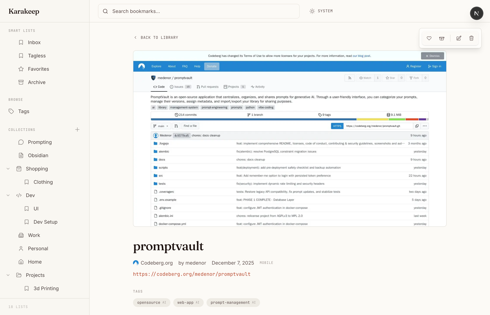
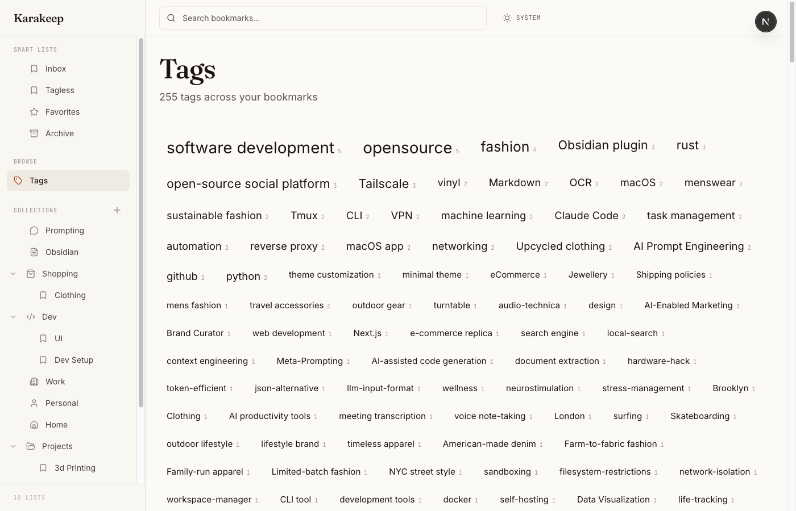
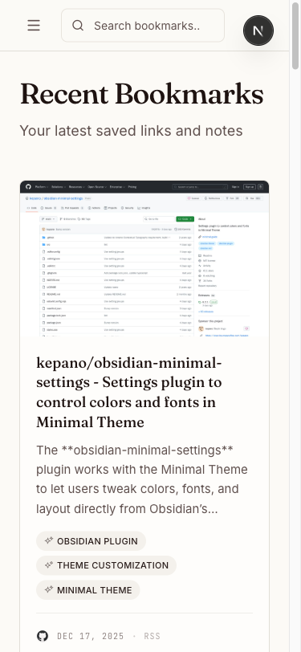
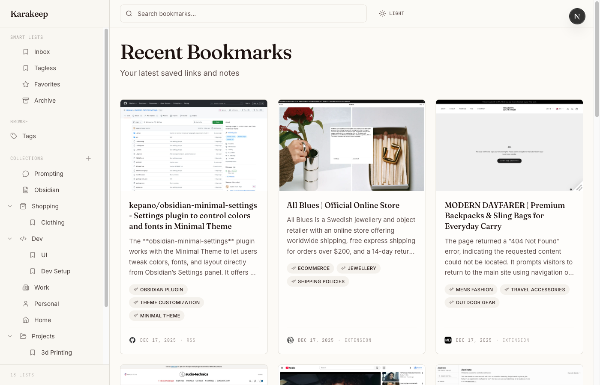

# KarakeepFE

A beautiful, editorial-style frontend for [Karakeep](https://github.com/karakeep-app/karakeep) bookmark manager. Built for personal use with a clean aesthetic.

## Features

- **Editorial Design** — Clean typography, generous whitespace, and large screenshot previews
- **Collection Management** — Organize bookmarks into hierarchical collections with custom icons
- **Smart Lists** — Dynamic lists based on search queries (Inbox, Tagless, custom filters)
- **Tag Browser** — Visual tag cloud with filtering
- **Dark Mode** — Full dark theme support
- **Responsive** — Works on desktop and mobile
- **AI Summaries** — Displays Karakeep's AI-generated summaries prominently

## Screenshots

<details>
<summary>View screenshots</summary>

### Bookmark Detail


### Tags Page


### Mobile View


### Dark Mode


</details>

## Tech Stack

- **Framework:** Next.js 14+ (App Router)
- **Styling:** Tailwind CSS
- **Components:** shadcn/ui primitives
- **Icons:** Lucide React

## Getting Started

### Prerequisites

- Node.js 18+
- A running [Karakeep](https://github.com/karakeep-app/karakeep) instance

### Installation

```bash
git clone https://github.com/spaceshipmike/karakeep-frontend.git
cd karakeep-frontend
npm install
```

### Configuration

Create a `.env.local` file:

```env
KARAKEEP_API_URL=http://localhost:3000
KARAKEEP_API_KEY=your-api-key-here
```

### Development

```bash
npm run dev
```

Open [http://localhost:3000](http://localhost:3000) in your browser.

### Production Build

```bash
npm run build
npm run start
```

## Project Structure

```
src/
├── app/                    # Next.js App Router pages
│   ├── bookmark/[id]/      # Bookmark detail page
│   ├── list/[slug]/        # Collection view
│   ├── tag/[name]/         # Tag filter view
│   ├── tags/               # Tag browser
│   └── search/             # Search results
├── components/
│   ├── bookmark/           # Bookmark cards and grids
│   ├── layout/             # Sidebar, Header, Footer
│   ├── list/               # Collection management
│   └── ui/                 # Shared UI components
├── lib/                    # API client, utilities
└── types/                  # TypeScript definitions
```

## API

KarakeepFE connects to Karakeep's REST API. Key endpoints:

- `GET /api/v1/lists` — Fetch all collections
- `POST /api/v1/bookmarks/search` — Search/paginate bookmarks
- `GET /api/v1/bookmarks/:id` — Get single bookmark
- `GET /api/assets/:id` — Serve screenshot images

See [Karakeep API docs](https://deepwiki.com/karakeep-app/karakeep) for details.

## License

MIT
